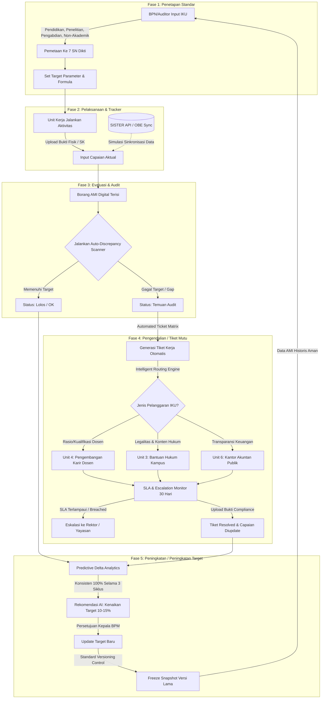

# 🛡️ Dokumentasi Alur Kerja Sistem SPMI - IKU Intelligent Deviation Router

Sistem **SPMI - IKU Intelligent Deviation Router** adalah platform penjaminan mutu internal dan eksternal perguruan tinggi yang mengotomatisasi siklus **PPEPP** (Penetapan, Pelaksanaan, Evaluasi, Pengendalian, dan Peningkatan). Sistem ini dirancang untuk memetakan standar Tridharma perguruan tinggi dan entitas non-akademik ke standar kementerian (SN Dikti), mendeteksi deviasi secara otomatis, melakukan *intelligent routing* tiket kerja mutu, serta memberikan rekomendasi peningkatan target berbasis AI.

---

## 📊 1. Diagram Alur Kerja Sistem (Siklus PPEPP)

Berikut adalah visualisasi alur kerja otomatis dari penetapan standar hingga peningkatan mutu menggunakan diagram Mermaid:



---

## 🛠️ 2. Penjelasan Detail Setiap Fase

### 1️⃣ Fase 1: Penetapan (Manajemen Target IKU)
*   **Tujuan:** Merancang standar mutu dan indikator kinerja utama sebagai acuan dasar institusi.
*   **Alur Kerja:**
    1.  Kepala Badan Penjaminan Mutu (BPM) menginput nama indikator IKU.
    2.  Mengelompokkan indikator ke dalam kategori **Rumpun Mutu** terstruktur yang dibagi menjadi:
        *   **Entitas Akademik (Tridharma)**:
            1. *Pendidikan* (Contoh: IKU Kurikulum OBE, Dosen S3)
            2. *Penelitian* (Contoh: Publikasi Internasional per Dosen)
            3. *Pengabdian Kepada Masyarakat* (Contoh: Hilirisasi Hasil Riset)
        *   **Entitas Non-Akademik**:
            1. *Organisasi* (Contoh: Akreditasi ISO Unit Kerja)
            2. *Keuangan* (Contoh: Opini KAP WTP/WDP)
            3. *Kemahasiswaan* (Contoh: Kecepatan Kerja Lulusan)
            4. *Ketenagaan* (Contoh: Sertifikasi Keahlian Tendik)
            5. *Sarana Prasarana* (Contoh: Luas Ruang Belajar per Mahasiswa)
    3.  Aplikasi menyediakan **Sidebar Menu Dropdown Interaktif** yang mengelompokkan kategori Akademik dan Non-Akademik dalam menu lipat (collapsible folder) dengan icon Chevron dinamis untuk penyaringan data yang presisi.
    4.  Menghubungkan indikator dengan **Standar Kementerian (7 SN Dikti)** sebagai standar kepatuhan dasar.
    5.  Menentukan **Formula Perhitungan**, **Tipe Parameter** (Persentase, Nominal, atau Kualitatif), serta **Operator Pembanding** (minimal $\ge$, maksimal $\le$, atau $=$).
    6.  Data tersimpan di dalam skema standar backend.

### 2️⃣ Fase 2: Pelaksanaan (Pengumpulan Data & Tracker)
*   **Tujuan:** Menyediakan ruang bagi prodi dan unit non-akademik untuk menyetor data capaian riil mereka secara berkelanjutan.
*   **Alur Kerja:**
    1.  Unit kerja mengunggah capaian aktual berdasarkan indikator yang ditentukan di Fase 1.
    2.  Mengunggah tautan (**Evidence Uploader**) berupa dokumen legalitas, SK Rektor, MoU, atau bukti fisik pendukung lainnya.
    3.  Mendukung sinkronisasi API data eksternal:
        *   **SISTER API:** Menarik otomatis kualifikasi dan fungsional dosen (simulasi update IKU-001).
        *   **OBE System API:** Menarik otomatis status kurikulum berbasis capaian (simulasi update IKU-002).

### 3️⃣ Fase 3: Evaluasi (Audit & Evaluasi Digital)
*   **Tujuan:** Auditor melakukan penilaian kepatuhan berdasarkan data riil dari pelaksanaan.
*   **Alur Kerja:**
    1.  Aplikasi menyediakan **Borang AMI Digital** di mana indikator capaian terisi secara otomatis dari data Fase 2.
    2.  Auditor menjalankan **Auto-Discrepancy Detector**:
        *   Sistem membandingkan target di Fase 1 dengan data riil di Fase 2 menggunakan operator logika (misal: Capaian Dosen S3 32% < Target 40%).
        *   Jika terdeteksi celah/gap (target tidak terpenuhi), sistem menandai indikator tersebut sebagai **"Temuan Audit"** dan secara otomatis menerbitkan Borang Digital bertanda merah.

### 4️⃣ Fase 4: Pengendalian (Intelligent Routing & SLA)
*   **Tujuan:** Menindaklanjuti temuan audit secara objektif melalui alur penugasan otomatis tanpa intervensi manual staf.
*   **Alur Kerja:**
    1.  Setiap Temuan Audit secara otomatis diubah menjadi **Tiket Kerja Digital**. Tiket mencakup deskripsi temuan, parameter IKU yang dilanggar, rekomendasi perbaikan, unit penanggung jawab, serta batas waktu penyelesaian (**SLA 30 hari**).
    2.  **Intelligent Routing Engine** mendistribusikan tiket secara otomatis ke unit spesifik:
        *   *Kualifikasi Dosen Jeblok* $\rightarrow$ **Lembaga Konsultan Pengembangan Karier Dosen (Unit 4)**.
        *   *Opini Laporan Keuangan Bermasalah* $\rightarrow$ **Kantor Akuntan Publik / Bagian Keuangan Utama (Unit 6)**.
        *   *Dokumen SK / Kontrak Celah Hukum* $\rightarrow$ **Lembaga Bantuan Hukum Perguruan Tinggi (Unit 3)**.
    3.  **Mekanisme Eskalasi Rektor:**
        *   Unit penanggung jawab diberi waktu 30 hari untuk mengunggah bukti perbaikan (*evidence of compliance*).
        *   Jika SLA terlampaui (**Breached**), status tiket otomatis naik ke **Dashboard Rektor / Pimpinan Yayasan** untuk intervensi struktural segera.
        *   Jika bukti diunggah dan disetujui, tiket dinyatakan **Resolved**, dan data capaian aktual di Fase 2 otomatis diperbarui memenuhi target (Pemulihan Mutu).

### 5️⃣ Fase 5: Peningkatan (Predictive Analytics & Versioning)
*   **Tujuan:** Memotivasi peningkatan standar mutu berkelanjutan (*Continuous Quality Improvement*) bagi unit berkinerja unggul tanpa merusak arsip lama.
*   **Alur Kerja:**
    1.  **Predictive Delta Analytics:** Jika suatu unit kerja secara konsisten (misal: 3 siklus berturut-turut) mencapai angka 100% pada suatu standar target, AI mendeteksi delta positif tersebut dan memunculkan rekomendasi otomatis untuk **menaikkan target standar sebesar 10-15%** (Melampaui SN Dikti untuk bersaing di tingkat internasional).
    2.  **Standard Versioning Control:** Sebelum standar dinaikkan, Kepala BPM membekukan data standar lama dengan mengambil **Snapshot Versi** (misal: Versi Standard 2025). Hal ini memastikan riwayat Audit Mutu Internal (AMI) tahun-tahun sebelumnya tidak rusak (*corrupted*) karena kehilangan referensi parameter aslinya.

---

## 🖧 3. Integrasi Arsitektur Data & API Endpoints

Aplikasi dibangun menggunakan **Express** di backend (`be-iku`) dan **React** di frontend (`fe-iku`) dengan pertukaran data berbasis JSON melalui endpoint berikut:

### ⚙️ REST API Endpoints (`be-iku`)

| Metode | Endpoint | Modul / Fase | Deskripsi |
| :--- | :--- | :--- | :--- |
| **GET** | `/api/standards` | Fase 1 | Mengambil daftar seluruh indikator standar IKU aktif |
| **POST** | `/api/standards` | Fase 1 & 5 | Menambah standar baru atau meng-update target IKU (AI Elevation) |
| **DELETE** | `/api/standards/:id` | Fase 1 | Menghapus standar IKU berdasarkan ID |
| **GET** | `/api/achievements` | Fase 2 | Mengambil data capaian riil seluruh indikator |
| **POST** | `/api/achievements` | Fase 2 | Mengunggah/memperbarui capaian riil & dokumen bukti fisik |
| **POST** | `/api/sync-api/:source` | Fase 2 | Simulasi integrasi API eksternal (`SISTER` / `OBE`) |
| **GET** | `/api/audit-forms` | Fase 3 | Mengambil daftar Borang Evaluasi AMI Digital |
| **POST** | `/api/audit-forms/detect-discrepancy` | Fase 3 & 4 | Memicu scan deviasi otomatis & auto-generasi tiket penugasan |
| **GET** | `/api/tickets` | Fase 4 | Mengambil daftar tiket kerja digital & status SLA |
| **POST** | `/api/tickets/:id/resolve` | Fase 4 | Menyelesaikan tiket dengan menyetor bukti perbaikan (*compliance*) |
| **POST** | `/api/tickets/:id/escalate` | Fase 4 | Eskalasi tiket manual ke Dashboard Rektor |
| **GET** | `/api/predictive-analytics` | Fase 5 | Menganalisis trend historis dan menghasilkan usulan kenaikan target |
| **GET** | `/api/versions` | Fase 5 | Mengambil daftar snapshot versi standar yang dibekukan |
| **POST** | `/api/standards/versioning/snapshot` | Fase 5 | Membekukan standar aktif saat ini menjadi snapshot versi historis |

---

## 🚀 4. Panduan Menjalankan Sistem

Untuk menjalankan seluruh ekosistem aplikasi ini di mesin lokal Anda:

### 1. Jalankan Backend Server (Express)
1. Buka terminal baru dan masuk ke direktori backend:
   ```bash
   cd be-iku
   ```
2. Jalankan server:
   ```bash
   npm start
   ```
   *Server akan berjalan di:* `http://localhost:5000`

### 2. Jalankan Frontend Application (React)
1. Buka terminal baru lainnya dan masuk ke direktori frontend:
   ```bash
   cd fe-iku
   ```
2. Jalankan dev server:
   ```bash
   npm run dev
   ```
   *Aplikasi web dapat diakses di:* `http://localhost:5173/`

---

> **Catatan Penting:**  
> Seluruh penyimpanan data bersifat persisten menggunakan file database lokal `be-iku/data.json`. Anda dapat melakukan simulasi pengisian data, penghapusan, audit, eskalasi, hingga pembekuan versi secara aman dan melihat perubahannya secara langsung secara *real-time*.
